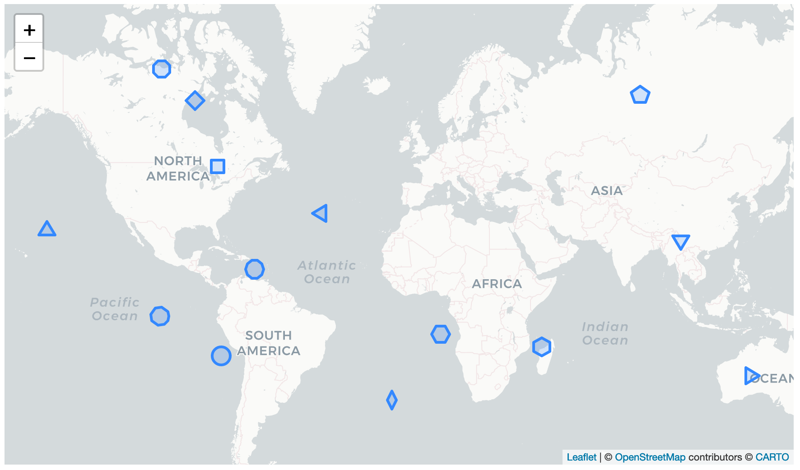

# leaflet-poly-marker

Polygonal Markers in Leaflet map 


Disclaimer: This is not a Node.js module, but a small script intended to be copy/pasted in your code or [included 
easily](https://stackoverflow.com/a/18049842) in your HTML page together with [Leaflet](https://leafletjs.com/):
```javascript
<script type='text/javascript' src='https://cdn.jsdelivr.net/gh/rizac/leaflet-poly-marker/polymarker.min.js'>
```
See also the
[example.html file](https://github.com/rizac/leaflet-poly-marker/blob/main/example.html)
for details

## Examples

```javascript
// Given a Leaflet map object:
var map = L.map(...);

// Create a Pentagon ('p') centered at [lat, lon] = [30, 40] with size in pixels
// given as the radius of the enclosing circle (When missing, radius defaults to 10)
var pmarker = L.polyMarker([30, 40], {marker: 'p', radius: 15, ...}).addTo(map);
        
// You can also create PolyMarkers with three arguments, supplying the marker separately
// as second argument (a missing marker will default to 's': square Polygon)
var pmarker = L.polyMarker([30, 40], 'p', {...}).addTo(map);

// When the marker is numeric (integer), it defines the Polygon sides.
// E.g., to draw a Dodecagon (12 sides):
var pmarker = L.polyMarker([30, 40], {marker: 12, ...}).addTo(map);
```

## Features

- PolyMarker is a leaflet [Polygon](https://leafletjs.com/reference-1.7.1.html#polygon) but behaves as a [CircleMarker](https://leafletjs.com/reference-1.7.1.html#circlemarker): given a center in `[lat lon]` coordinates the Polygon will be drawn around it
  and will **preserve its size in pixel, i.e. it will not expand or shrink while zooming in or out**. Regardless of this, all PolyMarker options
  (given in the Object passed as last argument) are the same as in Polygion, with the addition of `marker` and `radius` 
- Can be manipulated as all Leaflet objects and is relatively lightweight when compared to alternative solutions (e.g., DivIcon)
- Easy Polygon definition with no maths: just provide a single character marker (as in Python's
  [Matplotlib](https://matplotlib.org/stable/api/markers_api.html)) to draw the desired Polygon around its center (or an integer to define the polygon sides):
  - `s` square
  - `v` triangle_down
  - `^` triangle_up
  - `<` triangle_left
  - `>` triangle_right
  - `8` octagon
  - `p` pentagon
  - `h` hexagon1 (left and right sides aligned vertically)
  - `H` hexagon2  (top and bottom sides aligned horizontally)
  - `D` diamond
  - `d` thin_diamond (shrinked horizontally: width 50% of its height)
